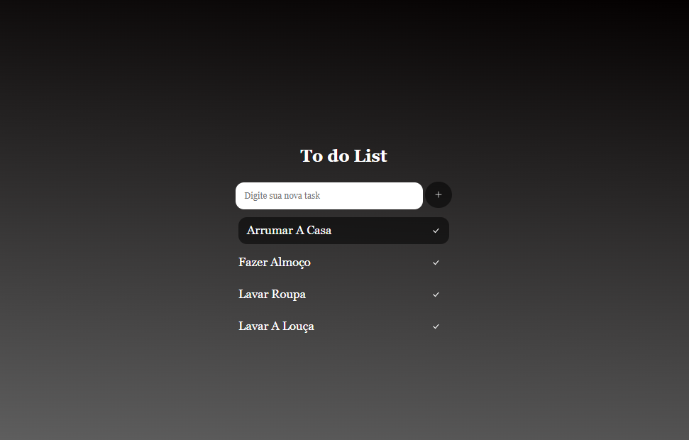

<h1 align="center" id="project_name">
   
    Lista de Tarefas
   
  
   
</h1>

Esse projeto foi desenvolvido a partir de pesquisas no youtube

<h2 id="about">
💻 Sobre o projeto
</h2>
Sempre ansiosa para colocar a mão na massa logo de cara!
 
Um dos primeiros projetos que desenvolvi. Não tinha muito conhecimento de programação, mas pegando varios videos no youtube e juntando em um só projeto, no fim, esse foi o resultado.

 
<h2 id="technologies">🛠 Tecnologias</h2>

As seguintes ferramentas foram usadas na construção do projeto:

- **[HTML](https://exemplo.com)**
- **[CSS](https://exemplo.com)**
- **[JS](https://exemplo.com)**

> Veja o arquivo [TodoList-ByMaddu](https://maddusilva.github.io/todo-list/)

**Utilitários**

- Editor: **[Visual Studio Code](https://code.visualstudio.com/)**

<h2 id="author">🦸 Autor</h2>
<a href="#">

 <b> Maria Eduarda da Silva </b></a>

 <h2 id="author">Social</h2>
<a href="#">

 

 

*Made with love ♡ by Maddu* 👋🏽 [Entre em contato!](https://www.linkedin.com/in/maddusilvadev/)
